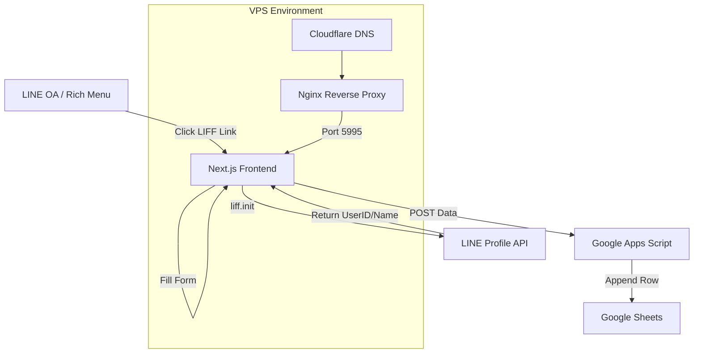

# System Documentation: LINE OA Form Integration

This document provide a comprehensive overview of the integration between LINE OA, a Next.js frontend, and Google Sheets, including the deployment architecture and setup instructions.

---

## 🏗️ Architecture Overview

The system is designed to be lightweight, bypassing a traditional backend database in favor of Google Sheets for data storage.



---

## 🛠️ Components & Technologies

| Component | Technology | Role |
| :--- | :--- | :--- |
| **Frontend** | Next.js 15, Tailwind CSS | High-performance, mobile-first form UI |
| **Integration** | LIFF (LINE Front-end Framework) | Identity verification & profile data collection |
| **Data Sink** | Google Apps Script (GAS) | Serverless handler for form submissions |
| **Storage** | Google Sheets | Real-time data storage and viewing |
| **Infrastructure** | Docker, Nginx, VPS | Containerized deployment with secure proxy |

---

## 🚀 Setup & Installation

### 1. Google Sheets & GAS
1. Create a new Google Sheet.
2. Open **Extensions > Apps Script**.
3. Copy the code from `google_apps_script.js`.
4. Deploy as **Web App** with **Anyone** access.

### 2. LINE Developers Console
1. Create a **Provider** and **LINE Login Channel**.
2. Add a **LIFF App**:
   - **Endpoint URL**: `https://nebles.needhome.co/en/owner`
   - **Scopes**: `profile`, `openid`
3. Copy the **LIFF ID**.

### 3. Environment Configuration
Create `.env.local` in `frontend-client/`:
```env
NEXT_PUBLIC_LIFF_ID=your_liff_id
NEXT_PUBLIC_GAS_URL=https://script.google.com/macros/s/AKfycbzoPUDR-U9fBO1OMt5IGJonsRR8PS6BBcgq6H0imKtC-6ZFMESw_nUJKYKmwb87XHos/exec
```

---

## 🌐 Deployment (VPS & Nginx)

### Nginx Configuration
The domain `nebles.needhome.co` must point to the VPS IP via Cloudflare (A Record) and be configured in Nginx:

```nginx
server {
    listen 80;
    server_name nebles.needhome.co;
    location / {
        proxy_pass http://127.0.0.1:5995;
        # ... standard proxy headers ...
    }
}
```
> [!IMPORTANT]
> Ensure SSL is configured via `Certbot` to enable HTTPS.

### Docker Production Build
Run from the root directory:
```bash
docker compose up -d --build
```

---

## 📝 Maintenance & Troubleshooting

- **Check Logs**: `docker compose logs -f`
- **Subsequent Deployments (การอัปเดตระบบ)**:
  1. **Local**: `git add .`, `git commit`, `git push origin main`
  2. **VPS**: `cd ~/Line-Nebles`, `git pull origin main`
  3. **VPS**: `docker compose up -d --build`
- **Data Access**: All submissions are instantly available in the designated Google Sheet.
- **LIFF Testing**: Test using the `https://liff.line.me/LIFF_ID` URL to ensure profile injection works.

---
**Created by Antigravity AI for Nebles Team**
